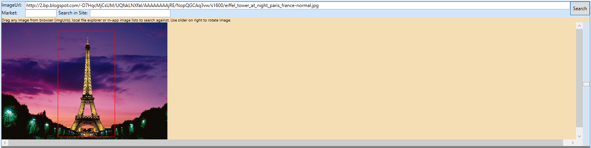
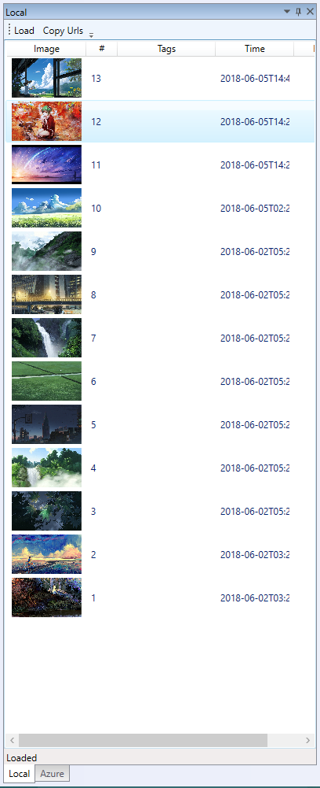
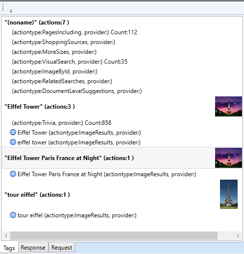
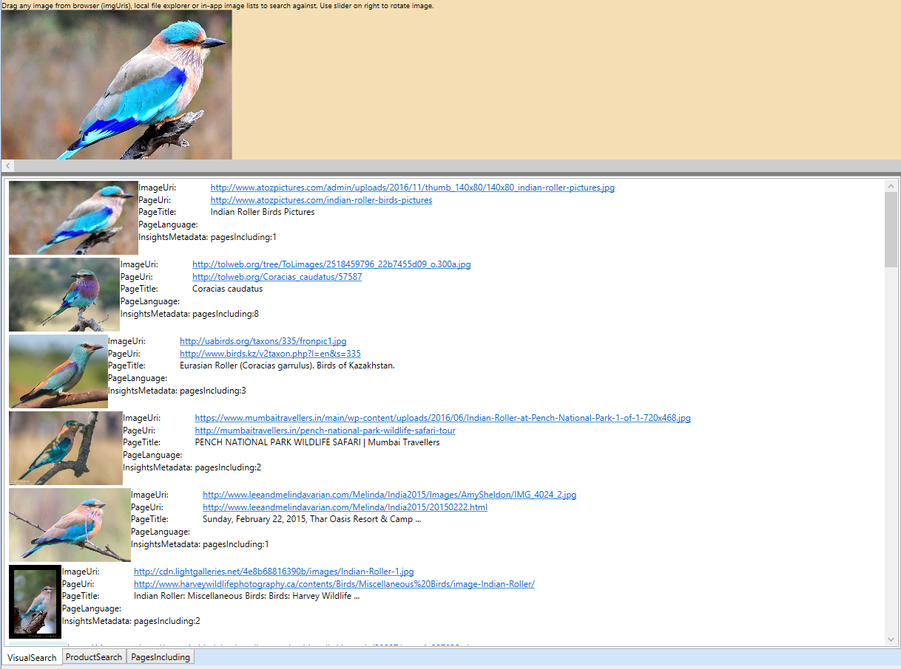
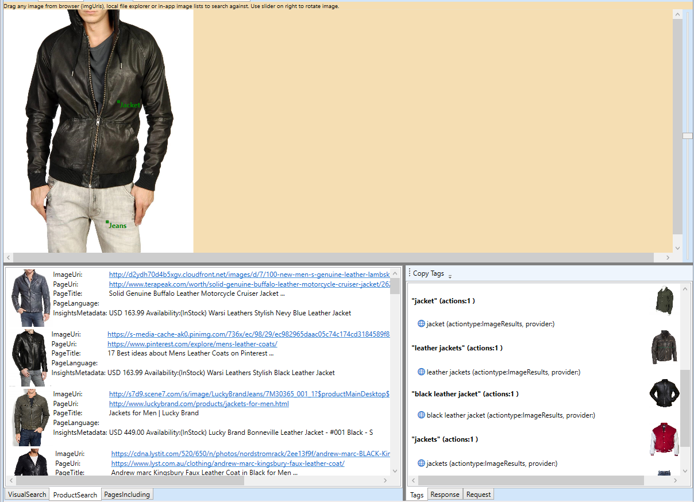

# Bing Visual Search Tools

# Table of Contents
- [Getting Started With VSPingCmd](#getting-started-with-vspingcmd)
- [Getting Started With VSPing](#getting-started-with-vsping)
- [Getting Started With VSWebApp](#getting-started-with-vswebapp)
- [VSPingCmd Features](#vspingcmd-features)
- [VSPing Features](#vsping-features)
- [VSWebApp Features](#vswebapp-features)

# VSPing, VSPingCmd, and VSWebApp

VSPing, VSPingCmd, and VSWebApp are applications to show off the possibilities of the Bing Image Search API, and to serve as demo/debug tools for projects that use the API.

VSPingCmd is a quick way to get started with the Bing Image Search API, a platform agnostic command application written in .NET Core that writes response JSON's to a text file. 

VSPing is a WPF application that makes it easier to view and understand the results of an image search, with support for searching local images, web URL's, or Azure blobs.

VSWebApp is an ASP.NET Core SPA (single page application) that demonstrates the possibilities of the Bing Visual Search API in a web development setting. It allows for easy searching of local and web images, and visualizes the results in a simple manner.  

The Bing Visual Search API provides information about an image similar to that found through Bing.com/images. Some notable features are finding a list of visually similar images, related searches, and shopping information about products in the image. ([More Information](https://docs.microsoft.com/en-us/azure/cognitive-services/bing-visual-search/))
## Getting-Started-with-VSPingCmd

### Prerequisites
- Windows, Linux, or Mac OS
- [.NET Core 2.0 or Higher](https://www.microsoft.com/net/download/windows)
  - [.NET Core 2.0 for Linux or Higher](https://docs.microsoft.com/en-us/dotnet/core/linux-prerequisites?tabs=netcore2x)
- [Newtonsoft.Json 11.0.2](https://www.nuget.org/packages/Newtonsoft.Json/) 
- [A Bing Visual Search API Key]( https://azure.microsoft.com/en-us/try/cognitive-services/?api=search-api-v7)

### Installation
- Enter your API Key into appConfig.json
- Build the project using dotnet (Linux/Windows) or Visual Studio (Windows)
#### Building The Project
- Build the project with dotnet
   - `dotnet build`
- Publish the project for your [target OS](https://docs.microsoft.com/en-us/dotnet/core/rid-catalog)
  - For Windows 10 64bit: `dotnet publish -c Release -r win10-x64`
  - For macOS: `dotnet publish -c Release -r osx.10.12-x64`
  - For Ubuntu: `dotnet publish -c Release -r ubuntu.15.10-x64`
- Copy appConfig.json to *.\bin\Release\netcoreapp2.0\<targetOS>\publish*
- Run the executable from *.\bin\Release\netcoreapp2.0\<targetOS>\publish\VSPingCmd.exe*

## Getting-Started-with-VSPing
### Prerequisites
- Windows 10 
- [.NET 4.6.1 or Higher](https://www.microsoft.com/net/download/windows)
- [A Bing Visual Search API Key]( https://azure.microsoft.com/en-us/try/cognitive-services/?api=search-api-v7)

### Installation
- Add your API key and Azure Container URL (optional) to App.config
- Open the solution in Visual Studio and build
#### Building The Project
- Right click on the project VSPing in the Visual Studio solution explorer (Not the solution) and select Publish
- Follow the steps in the Publish Wizard
- Navigate to the location where the application was published and run VSPing.application

## Getting-Started-with-VSWebApp
### Prerequisites
- Windows, Linux, or Mac OS
- [.NET Core 2.0 or Higher](https://www.microsoft.com/net/download/windows)
- [A Bing Visual Search API Key]( https://azure.microsoft.com/en-us/try/cognitive-services/?api=search-api-v7)

### Installation
- Add your API key to appsettings.json
- Open the solution in Visual Studio and build
#### Building The Project
- Right click on the project VSWebApp in the Visual Studio solution explorer (Not the solution) and select Publish
- Choose an option for publishing (Azure, IIS, Local, etc...)
- Follow the steps in the Publish Wizard

## VSPingCmd-Features
### Parameters
Parameter | Usage
---------|---------
-i   | [REQUIRED] Specify the file path of the input, this one can be a local image, web URI of an image, path of a local folder, or a local file where it has one or more local image paths or web URI's).
-o | [REQUIRED] Specify the file path where the output will be written to. 
-t     |[REQUIRED] Specify whether you have entered a single image (image), headered file containing URL's/paths to images (file), or a local folder containing images (folder). 
-column |[REQUIRED for files] Specify the name of the header column of the query URL's in the input text file. 
-delimiter |[REQUIRED for files] Specify which delimiter the input text file uses to establish new columns (The default delimiter is tabs, or '\t').
-jsonpath | Specify the location of a text file which defines what parts of the JSON response you want in the output file. For more information read "Output Scenarios".
-tags |Standalone parameter, only prints tags to the output file instead of the entire response JSON.
-p | Standalone parameter that prints all information to the command window as well as to the file.
### Inputs
#### Image
Choose one image to search, either from the web or from your computer (local files have 1mb max limit)
If searching a local image, the absolute path needs to be provided. 
 - ```VSPingCmd.exe -i home/image.jpg -o output.txt -t image ```
 - ```VSPingCmd.exe -i webimageurl.jpg -o output.txt -t image```

The corresponding output for the first query would be (tab delimited by default):


    URL               JSON 
    home/image.jpg    {...}

#### File
Choose one headered and delimited text file with multiple rows of image URL's (local or web) to search. The header of the column of URL's must be specified, along with the file's delimiter (Ex: "," for a CSV, \t by default) 

Additional columns can also be included, and will be copied over to the output file. 
  - ```VSPingCmd.exe -i home/documents/queryimages.txt -o output.txt -t file -column URL```
  - The corresponding input text file could look something like this. 
	 ```
    INDEX	SOMECOLUMN	URL                 
    1	foo	home/images/pic1.png
    2	bar	weburl.com/pic2.jpg 
    ```
 - The corresponding output text file would look like this: 
    ```
    INDEX   SOMECOLUMN  URL JSON 
    1   foo  home/images/pic1.png   {...}
    2   bar  weburl.com/pic2.jpg    {...}
    ```
#### Folder
Choose one local folder within which to search all images inside
  - ```VSPingCmd.exe -i home/imagefolder -o output.txt -t folder```

- The corresponding output would be (tab delimited by default):
    ```
    URL         JSON 
    pic1.png    {...}
    pic2.gif    {...}
    ```
### Output Jsonpath Selected Columns
VSPingCmd allows you to not just return the JSON response but also process it to extract fields from it. This can be done by specifying JSONPath mappings. The headerless mapping file specified in the parameters should have "outputColumnName" \t "ApiResponseJsonPath" mappings (1 per line). This allows for easy extraction of data from within the response JSON. With this mode, you can automate VisualSearch tasks using shell scripts or batch files over a large set of images.

Each specified output column will be added as columns on the right of those in an existing text file, or right of the image URL column if a folder or single image was the input. If no mapping is specified, each column will contain the full response JSON corresponding with the query URL

```
#Comment line in sample mapping file.
#First column is output column name.
#Second column in JSONPath to extract from JSON response
#These columns are tab delimited
JSON        $
Tags        $.tags[*].displayName
EntityIDs   $.tags[*].actions[?(@.actionType == 'Entity')].data.bingId
```

Usage of -jsonpath


```
VSPingCmd.exe -i home/documents/queryimages.txt -o output.txt -t file -column URL -jsonpath home/documents/jsonpath.txt
```

## VSPing-Features

### General Architecture
VSPing is built on the MVVM (model-view-viewmodel) pattern. This in order to allow the GUI and backend code to be developed in parallel. The View, Models and VM folders are in the found in the project file VSPingShared.

### Search Section
#### Main Views
- ImageModSection.xaml in VSPingShared
- SearchSection.xaml in VSPing
#### Functionality
- Specify the URI or drag and drop an image that you want to search
- Specify the market of the results that you want to search in ([xx-YY format](https://docs.microsoft.com/en-us/azure/cognitive-services/bing-visual-search/supported-countries-markets "Additional information about markets"))
- Only show visual search results from a specific site
- Crop part of an image to search
- Search a rotated version of an image
- 

### Query Image Store Section (Load Images from Azure or Local)
#### Main Views
- QueryImageStoreControl.xaml in VSPingShared
#### Functionality
- Load images from different image stores and easily search them with a double click or drag and drop
  - Currently supports images in a local folder and Azure blobs contained in your Azure account (see the App.config file).
  - The interface IImageStore (VSPing/Models/QueryImageStore) can be used to add additional image stores to the view
  - 

### Result Section
#### Main Views
- TabsSection.xaml in VSPing
- ImageResultsListControl.xaml in VSPingShared
- TagsOutputSection.xaml in VSPingShared
- TagsActionsControl.xaml in VSPingShared
#### Functionality
##### Tabs Subsection
###### Tags
  - Provides a series of tags for the image
  - Each tag has its own associated actions
	- If a tag has a non-default bounding box (box size != image size), the box is drawn on top of the query image
    - These allow for quick insights to be gleaned about the query image and facilitate follow up queries about items of interest detected in the image
  - 
###### Response
  - A JSON tree view of the entire response returned by the API
###### Request
  - A JSON tree view of the request sent to the API
##### Image Results Subsection
###### Visual Search
  - A list of images visually similar to the query image, with included information parsed from the response JSON
  - 
###### Product Search
  - Only populated for images where products are detected, contains information about similar products and where they can be purchased
  - This makes it easy to use an image of a product to find its name and possible locations where it can be purchased
  - 
###### Pages Including
  - A list of web pages that also have a copy of the query image
## VSWebApp-Features
### Inputs
- URI: Specify an image URI to search
- Market: Specify a region and language to receive results in ([More information](https://docs.microsoft.com/en-us/azure/cognitive-services/bing-visual-search/supported-countries-markets)) 
- Site: Specify a single website to receive results from 
- File: Specify an image from the local disc to automatically search
- Search: Search an image URI
### Outputs
#### Main Table
Contains the main search results parsed from the response JSON. Each image has a thumbnail, page title, image URI, page URI, and a button to search it.
##### Visual Search
Contains a list of images that are visually similar to the query image.
##### Product Search
Contains a list of products that are similar to the ones in the query image. Each product also has a best offer and offer price provided.
##### Pages Including
Contains a list of web pages that have a copy of the query image. 
#### Tags & Actions
Contains a list of tags for the image, and a list of associated actions for each tab. Some of the actions that VSWebApp displays are:
- Text Results: Information about text in the image
- Entity: Information about a notable, person, place, or thing in the image
- Image Results: More images related to a tag
- Trivia: Various trivia about a subject in an image, see the JSON for the full list
- Text Recognition: Clickable links for information found from OCR, including phone numbers and email addresses
#### JSON
Contains the entire response JSON, as well as a button to copy it to the clipboard.

## Report Abuse
To report abuse of the Microsoft Cognitive Services to Microsoft, please visit the Microsoft Cognitive Services website at https://www.microsoft.com/cognitive-services, and use the "Report Abuse" link at the bottom of the page to contact Microsoft.

## Privacy Policy
For more information about Microsoft privacy policies please see their privacy statement here: https://go.microsoft.com/fwlink/?LinkId=521839. 
